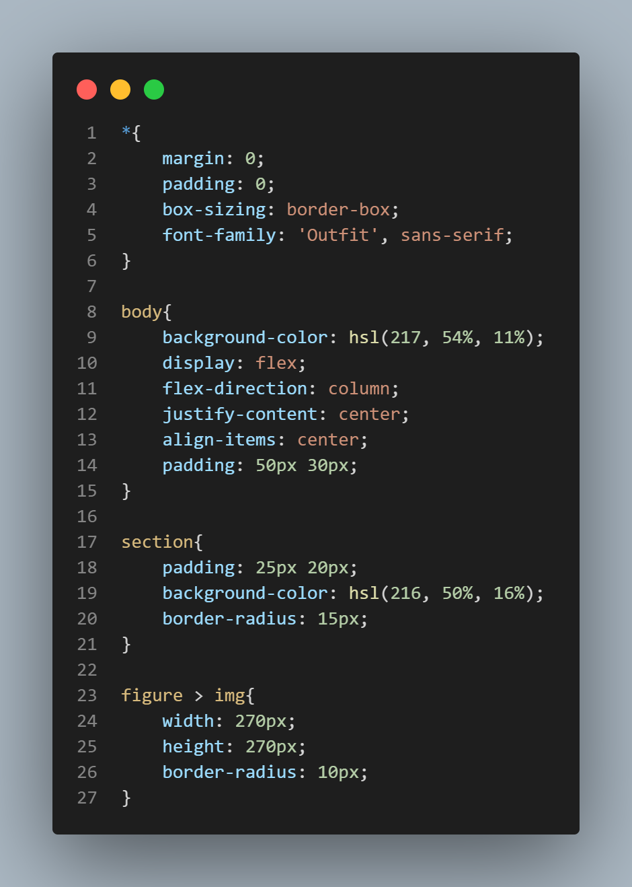

# Card-Componente-NFT

This project is a NFT card component developed mainly with HTML and CSS3, 
according to the Frontendmentor.io challenge specifications.


## Overview

This is the solution to the NFT challenge preview card component 
of Frontendmentor.io, in which 2 technologies were used: HTML and CSS3 
and version control was used through a Github repository.

This project can be displayed correctly in any resolution.
The recommended resolutions of the challenge were:
- Mobile: 375 px
- Desktop: 1440 px
### Screenshots





### Links

- Solution URL: [GitHub](https://github.com/yomidev/Card-Componente-NFT)
- Live Site URL: [Github Pages](https://yomidev.github.io/Card-Componente-NFT/)
## Built with

- HTML 5
- CSS 3
- Flexbox
- CSS Transitions
- Mobile-first workflow
### What I learned

In this project I reinforced my skills in structuring HTML elements; 
I also learned how to use flexbox and how to center an element that 
has an absolute position:

```css
.eye > img{
    max-width: 270px;
    max-height:270px;
    top: 0;
    bottom: 0;
    margin: auto;
    left: 0;
    right: 0;
    position: absolute;
    opacity:0
}

```


## Authors

- Github - [@yomidev](https://github.com/yomidev)
- Frontendmentor.io - [@yomidev](https://www.frontendmentor.io/profile/yomidev)
- Instagram - [@devinfront](https://www.instagram.com/devinfront/)